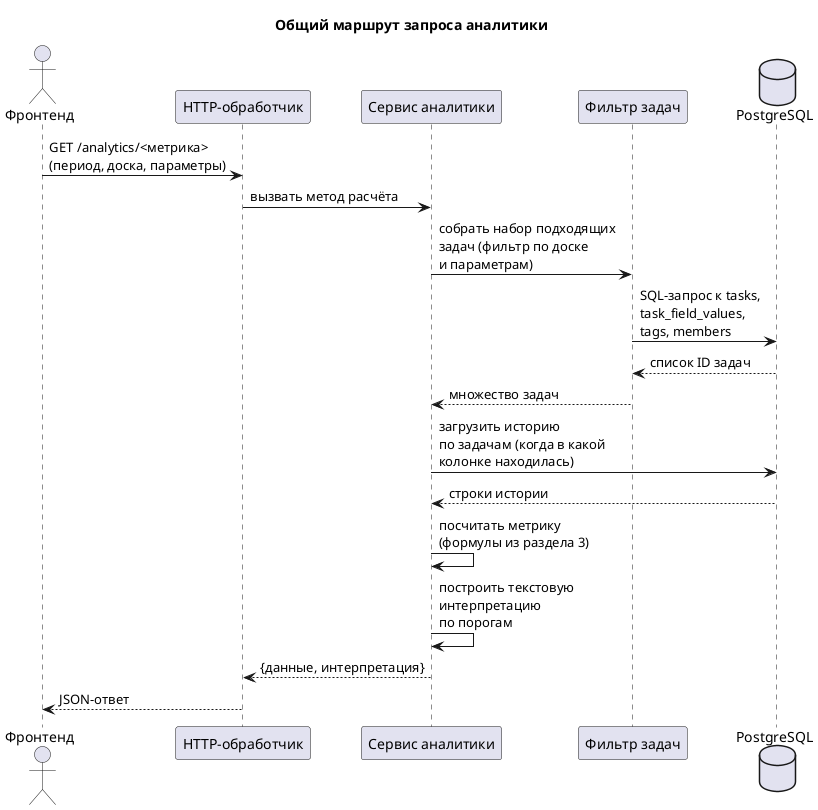
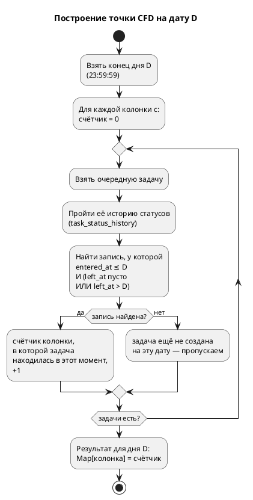
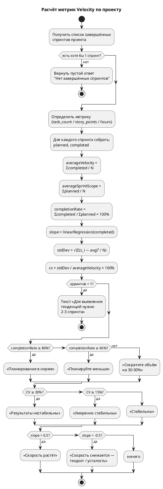
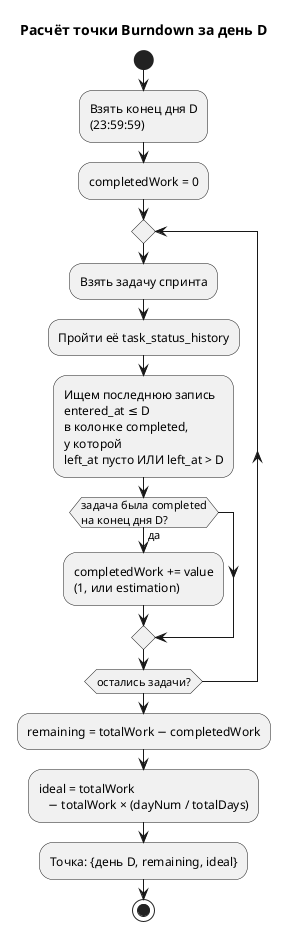
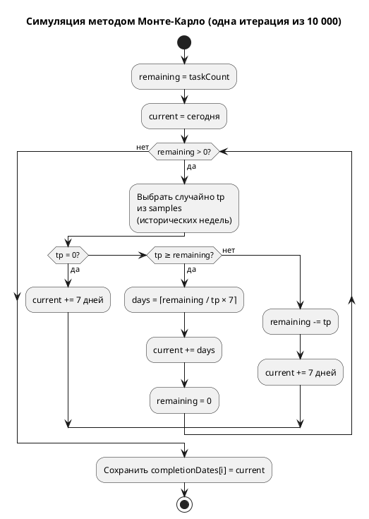

# Пояснение к алгоритмам аналитики Projektus

Этот документ написан для человека, который **не работает каждый день с математической статистикой**, и при этом должен уметь защищать дипломную работу: рассказать, как и почему устроены расчёты аналитических отчётов в бэкенде Projektus, и сослаться на авторитетные источники. Поэтому объяснения даны в два слоя:

1. **«По-человечески»** — что делает алгоритм и зачем он вообще нужен.
2. **«Формула»** — как это записано в коде, с точной ссылкой на файл и строки.

После каждого раздела есть блок **«Почему именно так»** с цитатами из официальных руководств и специализированной литературы (на русском, где возможно; на английском — с переводом ключевой мысли). В конце документа — **общий список источников**.

Диаграммы выполнены в PlantUML на русском языке. Любой блок с тегом ` ```plantuml ` можно скопировать в онлайн-редактор [plantuml.com](https://www.plantuml.com/plantuml/) и сразу увидеть картинку.

---

## Содержание

1. [Общая картина: как аналитика устроена в проекте](#1-общая-картина)
2. [Где живут данные: откуда берутся цифры](#2-где-живут-данные)
3. [Базовый статистический аппарат (объяснение один раз)](#3-базовый-статистический-аппарат)
4. [Kanban-аналитика](#4-kanban-аналитика)
   - 4.1 [Сводка (Summary)](#41-сводка-summary)
   - 4.2 [Накопительная диаграмма потока (CFD)](#42-накопительная-диаграмма-потока-cfd)
   - 4.3 [Диаграмма рассеяния времени выполнения (Cycle Time Scatter)](#43-диаграмма-рассеяния-времени-выполнения)
   - 4.4 [Пропускная способность (Throughput)](#44-пропускная-способность-throughput)
   - 4.5 [Тренд пропускной способности](#45-тренд-пропускной-способности)
   - 4.6 [Среднее время выполнения по неделям](#46-среднее-время-выполнения-по-неделям)
   - 4.7 [История WIP](#47-история-wip)
   - 4.8 [Распределение времени выполнения](#48-распределение-времени-выполнения)
   - 4.9 [Распределение пропускной способности](#49-распределение-пропускной-способности)
5. [Scrum-аналитика](#5-scrum-аналитика)
   - 5.1 [Скорость команды (Velocity)](#51-скорость-команды-velocity)
   - 5.2 [Диаграмма сгорания (Burndown)](#52-диаграмма-сгорания-burndown)
6. [Прогноз методом Монте-Карло](#6-прогноз-методом-монте-карло)
7. [Фильтрация задач (параметры и доски)](#7-фильтрация-задач)
8. [Источники](#8-источники)

---

## 1. Общая картина

У Projektus два режима работы проекта: **Scrum** и **Kanban**. Они опираются на разные управленческие практики, поэтому и наборы аналитических метрик у них разные:

| Scrum | Kanban |
|---|---|
| Скорость команды (Velocity) | Сводка (Summary) |
| Диаграмма сгорания (Burndown) | Накопительная диаграмма потока (CFD) |
| | Диаграмма рассеяния времени цикла (Cycle Time Scatter) |
| | Пропускная способность (Throughput) |
| | Тренд пропускной способности |
| | Среднее время выполнения по неделям |
| | История WIP |
| | Распределение времени выполнения |
| | Распределение пропускной способности |
| | Прогноз методом Монте-Карло |

Ответ каждого эндпоинта состоит из двух частей: **данные для построения графика** (точки по оси X/Y) и **текстовая интерпретация**, собранная из нескольких шаблонных предложений по правилам-пороговым значениям. Порог, при котором текст говорит «процесс предсказуем» или «стоит обратить внимание», — это **решающее место**: его нужно уметь защитить цитатами, поэтому в каждом разделе ниже пороги вынесены отдельно.

### Общий маршрут запроса



---

## 2. Где живут данные

В расчётах используются четыре группы сущностей в базе:

- **`tasks`** — сами задачи: дата создания, дата завершения, поле `priority`, поле `estimation`, привязка к доске.
- **`task_status_history`** — история переходов задачи по колонкам. По ней восстанавливается: «в какой колонке задача находилась в такой-то момент времени». Это фундамент для CFD, burndown, cycle time, WIP.
- **`columns`** — колонки доски с типом (`initial`, `in_progress`, `paused`, `completed`). Все расчёты времени в работе опираются на эти типы, а не на имена: имя «Ready» может быть и «initial», и «in_progress» в разных проектах.
- **`task_field_values`**, **`tags`**, **`members`** — то, по чему можно отфильтровать задачи (раздел 7).

Ключевые производные величины, которые алгоритмы считают сами:

- **`startedAt`** — момент, когда задача впервые попала в колонку типа `in_progress`.
- **`completedAt`** — момент, когда задача перешла в колонку типа `completed` (и осталась там).
- **`cycleTime`** = `completedAt − startedAt`, обычно в днях.

> **Почему не «с момента создания»?** Мы хотим мерить время реальной работы, а не «пролежала в бэклоге». Это соответствует официальному канбан-определению Cycle Time: «время, когда клиент *начал* работу над задачей и *завершил*». См. [Kanban University, Official Kanban Guide, 2020](https://kanban.university/kanban-guide/):
>
> > *«Work-item cycle time... the amount of elapsed time between when a work item started and when a work item finished.»* — «Время цикла элемента работы… количество прошедшего времени с момента начала работы и до её завершения».

---

## 3. Базовый статистический аппарат

Эти понятия встречаются снова и снова по всему документу. Разбираем их один раз.

### 3.1 Среднее арифметическое (mean)

Сумма значений, делённая на их количество:

> **avg** = (x₁ + x₂ + … + xₙ) / n

Плюсы: интуитивно. Минус: один «выброс» (один проект ушёл в три недели вместо обычных трёх дней) сильно сдвигает среднее в сторону выброса. Поэтому в канбан-отчётах наряду со средним смотрят **медиану** и **процентили** — они к выбросам устойчивы.

### 3.2 Медиана и процентили

**Медиана (P50)** — такое число, что половина всех измерений ниже него, а половина — выше.

**P85** — число, ниже которого оказываются 85% всех измерений. То есть только 15% задач были «хуже» этого значения. Почему именно 85? Это общепринятая канбан-практика, идущая от Дэниела Ваканти:

> *«The 85th percentile stands at 16 days. What it means, that with everything else equal, a usual right-sized worked item entering your system has a probability of 85% of being completed in less than 16 days.»* ([Scrum.org, «Getting to 85»](https://www.scrum.org/resources/blog/getting-85-agile-metrics-actionableagile-part-1)) — «85-й процентиль стоит на 16 днях. Это значит, что при прочих равных типовая корректно нарезанная задача, попавшая в вашу систему, имеет вероятность 85% быть завершённой менее чем за 16 дней».

Именно поэтому при обещаниях клиентам в Projektus в интерпретациях пишется «с вероятностью 85% задача будет завершена за X дней или меньше» — это стандартная формулировка соглашения об уровне обслуживания (SLA) в канбан.

**Как в коде считается процентиль:** `computePercentile` в `internal/services/kanban_analytics_service.go:196–208`. Алгоритм — линейная интерполяция:

1. Отсортировать значения по возрастанию.
2. Рассчитать позицию: `idx = p/100 × (n − 1)`.
3. Если `idx` — целое, берём `sorted[idx]`. Если нет — берём взвешенное среднее между соседними точками.

Такой способ соответствует рекомендации NIST:

> *«When the desired percentile falls between two data points, linear interpolation estimates the value by proportionally adjusting between the surrounding observations.»* ([NIST Engineering Statistics Handbook, §7.2.6.2](https://www.itl.nist.gov/div898/handbook/prc/section2/prc262.htm)) — «Когда искомый процентиль оказывается между двумя точками данных, линейная интерполяция оценивает значение, пропорционально усредняя соседние наблюдения».

### 3.3 Стандартное отклонение и коэффициент вариации

**Стандартное отклонение (σ)** — «насколько широк разброс». Считается так:

> σ = √( Σ(xᵢ − avg)² / n )

**Коэффициент вариации (CV)** = σ / avg — отношение разброса к среднему. Это **безразмерная** величина: можно сравнивать процессы с разной единицей измерения (дни и story points — без проблем). Чем меньше CV, тем **предсказуемее** процесс.

В Projektus CV применяется как «индикатор стабильности» в нескольких местах. Пороги взяты из отраслевой практики:

| CV | Трактовка в коде | Русскоязычный стандарт |
|---|---|---|
| < 15% | «стабильно» | [Википедия: Коэффициент вариации](https://ru.wikipedia.org/wiki/Коэффициент_вариации) — «низкая изменчивость» |
| 15–30% | «умеренно стабильно» | «умеренная изменчивость» |
| ≥ 30% | «нестабильно» | «высокая изменчивость» |

> Цитата: *«Коэффициент вариации… показывает степень изменчивости по отношению к среднему. CV < 15% — низкая; 15–30% — умеренная; > 30% — высокая.»* ([Loginom Wiki, Variation Coefficient](https://wiki.loginom.ru/articles/variation-coefficient.html)).

Для диаграммы рассеяния (Scatter) пороги ещё мягче — процесс более вариативен по своей природе, поэтому используется граница CV = 0.5 и CV = 1.0 (в долях, не процентах):

| CV | Трактовка |
|---|---|
| < 0.5 | предсказуем |
| 0.5–1.0 | умеренный разброс |
| ≥ 1.0 | очень непредсказуем, рекомендуется декомпозиция задач |

Этот более «щадящий» порог для данных о сроках выполнения согласуется с рекомендациями сообщества ProKanban, где разбросы с CV ≥ 1 считаются «high variability».

### 3.4 Линейная регрессия (определение тренда)

Когда у нас есть ряд значений по неделям или спринтам, нам хочется понять: **тренд — вверх или вниз?** Для этого строится прямая линия, которая «лучше всего» проходит через точки — по **методу наименьших квадратов (МНК)**: минимизируется сумма квадратов вертикальных расстояний от каждой точки до прямой.

Прямая имеет вид **y = a·x + b**. В коде (`linearRegressionLine` в `kanban_analytics_service.go:210–241`) рассчитывается коэффициент `slope` (это «a»). Знак `slope` говорит о направлении тренда, абсолютная величина — о силе.

Пороги для словесной интерпретации (применяются почти везде в отчётах):

- `slope > 0.5` → «тренд растущий»
- `slope < −0.5` → «тренд снижающийся»
- между → «стабильно»

Это не магические числа, а практическое правило: меньшее, чем ±0.5, «движение» за неделю обычно укладывается в статистический шум при малой выборке (8 недель, 6–10 спринтов). Теория МНК описана, например, в курсе МГУ по эконометрике:

> *«МНК-оценки для классической линейной регрессии являются несмещёнными, состоятельными и наиболее эффективными оценками в классе всех линейных несмещённых оценок.»* ([МГУ, «Введение в эконометрику», §2.2](https://books.econ.msu.ru/Introduction-to-Econometrics/chap02/2.2/)) — фундаментальная теорема Гаусса-Маркова: из всех линейных способов провести прямую через точки, МНК даёт самый точный.

### 3.5 Гистограммы (распределения)

Гистограмма — это когда мы берём все измерения (например, cycle times всех задач) и разбиваем их на «корзинки» (bucket / bin) фиксированной ширины, считая, сколько попало в каждую. В Projektus (`buildDistribution`, строки 243–289):

- Для **cycle time distribution** ширина корзинки фиксирована: **2 дня**. Это обычный выбор для канбан-отчётов.
- Для **throughput distribution** ширина рассчитывается автоматически: `bucketSize = ⌈max / 8⌉`, минимум 1. Цель — получить 6–8 корзинок для выборки в 12 недель.
- Всего корзинок — не более 20 (пустые хвосты обрезаются, чтобы график был читабелен).

Академически «правильный» способ выбирать число корзинок — **правило Стёрджеса**: k = 1 + log₂N ([Википедия: Правило Стёрджеса](https://ru.wikipedia.org/wiki/Правило_Стёрджеса)). Для 12 недель Стёрджес даёт ≈ 5 корзинок, для всех завершённых задач проекта в 100 шт. — ≈ 8. Наши пороги (`/8` для throughput, фикс «2 дня» для cycle time) осознанно держатся в этом диапазоне.

---

## 4. Kanban-аналитика

Все значения берутся через фильтр задач (раздел 7), поэтому ниже «завершённые задачи» означает «задачи, прошедшие фильтр пользователя (доска, период, параметры) и имеющие `completedAt`».

### 4.1 Сводка (Summary)

**Файл:** `internal/services/kanban_analytics_service.go`, методы `GetSummary` (303–427), `generateSummaryInterpretation` (455–487).

**Что показывает.** «Приборная панель»: четыре главных числа о состоянии потока — пропускная способность, время выполнения, оценочная скорость и текущий WIP — каждое с направлением динамики за последнюю неделю.

**Как считается.**

Берутся две смежные двухнедельные «корзины»: «последние 2 недели» и «2–4 недели назад». Это позволяет сравнить «сейчас» и «недавно».

- **Throughput** = кол-во завершённых задач за 2 недели ÷ 2 (задач в неделю).
- **CycleTime** = средний cycle time завершённых за 2 недели задач в днях.
- **Velocity** = сумма `estimation` завершённых задач ÷ 2 (если единица оценки — story points или часы). Если единица — «количество задач», velocity совпадает с throughput.
- **WIP** = число задач, которые прямо сейчас находятся в колонках типа `in_progress` или `paused`.
- **WipChange** = WIP сейчас − WIP неделю назад.

**Как читать тренды.** Формула `percentChange(prev, curr) = (curr − prev) / prev × 100%` (с защитой от деления на ноль). Если изменение по абсолютной величине меньше 10%, текст интерпретации ничего не пишет (это шум). Если больше — сообщает о росте или снижении.

**Пороги для текста.**

| Метрика | Текст «хорошо» | Текст «внимание» |
|---|---|---|
| ThroughputTrend > +10% | «пропускная способность растёт» | — |
| ThroughputTrend < −10% | — | «пропускная способность снижается» |
| CycleTimeTrend < −10% | «среднее время выполнения улучшается» | — |
| CycleTimeTrend > +10% | — | «среднее время выполнения растёт — обратите внимание» |
| WipChange > 0 | — | «WIP вырос — возможна перегрузка» |
| WipChange < 0 | «WIP снизился» | — |

**Почему именно так.** Сводка собирает так называемые **Flow Metrics** — четыре базовых показателя потока в канбан-методологии: Work In Progress, Throughput, Cycle Time и ставший традиционным в продуктовом менеджменте Velocity.

> *«A shift from traditional agile metrics (Story Points, Velocity) to actionable flow metrics (Work In Progress, Cycle Time, Throughput) reduced Cycle Times, increased quality, and increased overall predictability.»* ([Teamhood, «What are Actionable Agile Metrics»](https://teamhood.com/agile/actionable-agile-metrics/)) — «Переход от традиционных метрик (Story Points, Velocity) к флоу-метрикам (WIP, Cycle Time, Throughput) сокращал время выполнения, повышал качество и повышал общую предсказуемость».

Связь этих четырёх величин не случайная: они связаны **законом Литтла** (Little's Law, 1961, доказательство опубликовано Джоном Литтлом из MIT):

> **WIP = Throughput × CycleTime**

> *«Little’s Law states that the average number of items within a system is equal to the average arrival rate of items into and out of the system multiplied by the average amount of time an item spends in the system.»* ([SixSigma.us, «All About Little's Law»](https://www.6sigma.us/six-sigma-in-focus/littles-law-applications-examples-best-practices/)) — «Закон Литтла утверждает, что среднее число элементов в системе равно средней интенсивности прибытия, умноженной на среднее время, проводимое элементом в системе».

Именно поэтому в сводке показываются все три величины одновременно — если растёт WIP, а throughput стоит на месте, мы неизбежно получим рост cycle time. И наоборот: чтобы cycle time снизился, нужно либо нарастить throughput, либо снизить WIP.

Порог **±10%** для подачи тренда в текст — эмпирический компромисс: более жёсткий порог (например, ±5%) привёл бы к срабатыванию каждую неделю, делая отчёт «кричащим»; более мягкий (±20%) — пропустил бы реальные тренды.

---

### 4.2 Накопительная диаграмма потока (CFD)

**Файл:** `kanban_analytics_service.go:489–621`.

**Что показывает.** Для каждого дня из последних 30 и для каждой колонки доски — сколько задач находилось в этой колонке на конец того дня. На графике это «слои»: каждая колонка рисуется полосой, сложенной поверх предыдущей.

**Как читать картинку.** Горизонтальная ось — даты, вертикальная — накопленное число задач. Ширина каждой цветной полосы = число задач в этой колонке в тот день. Если полоса «Тестирование» начинает вертикально расти, а «В разработке» стабильна — значит, тестировщики не успевают, копится очередь.

**Как считается.**



Этот цикл повторяется для каждого из 30 дней.

**Интерпретация.** Правила в коде:

- Колонка, которая за 30 дней прибавила **более 2 задач**, отмечается как **«узкое место»**.
- Если колонка «completed» выросла более чем на 5 задач — в тексте пишется «поток стабилен».

**Почему именно так.**

Накопительная диаграмма потока — стандартный инструмент канбан-анализа, формально входящий в Official Kanban Guide. Её смысл и способ чтения в русскоязычной литературе кратко сформулированы так:

> *«Узкая область = задачи проходят этап быстро, широкая область = задачи задерживаются на этапе, и если область со временем расширяется — на этапе копятся задачи, это сигнал проблемы.»* ([Kaiten, «Накопительная диаграмма потока для начинающих»](https://kaiten.ru/blog/cfd-for-beginners/))

> *«Следите за резким увеличением градиента в одной или нескольких полосах — это указывает на то, что WIP увеличивается и образуется узкое место.»* ([Cleverics, «Чтение знаков: Паттерны Канбан CFD»](https://cleverics.ru/digital/2021/10/chtenie-znakov-patterny-kanban-cfd/))

Наш порог «+2 задачи за 30 дней» — консервативный: он не срабатывает на случайных «горбах» в 1 задачу, но надёжно ловит систематическое расширение полосы.

---

### 4.3 Диаграмма рассеяния времени выполнения

**Файл:** `kanban_analytics_service.go:623–707`.

**Что показывает.** Каждая завершённая задача — одна точка. По X — дата завершения, по Y — cycle time в днях. Поверх точек рисуются горизонтальные линии P50, P85 — «SLA-линии».

**Как читается.** Если 95% точек лежат ниже линии P85 = 5 дней — значит, мы можем обещать клиенту «обычно за 5 дней». Если точки сильно разбросаны по вертикали (одни 0.5 дня, другие 30 дней) — процесс непредсказуем.

**Что считается.**

1. Берутся все завершённые задачи (без ограничения по периоду — важно для статистики).
2. Для каждой: точка `{ключ_задачи, cycleTimeDays}`.
3. Считается среднее, медиана (P50), P85.
4. Считается коэффициент вариации `cv = σ / avg`.

**Пороги интерпретации.**

| CV | Текст |
|---|---|
| < 0.5 | «процесс предсказуем — разброс небольшой» |
| 0.5–1.0 | «разброс умеренный — некоторые задачи занимают значительно больше времени» |
| ≥ 1.0 | «разброс очень большой — процесс непредсказуем. Рекомендация: декомпозируйте крупные задачи» |

**Почему именно так.**

Диаграмма рассеяния — «родная» канбан-диаграмма для ответа на вопрос «Когда это будет готово?». Визуальная логика описана у Ваканти и в учебных материалах Nave/Businessmap:

> *«The dotted horizontal lines stretching across the graph are called percentile lines… the 50th, 85th, and 95th percentiles are probably the most popular "standard" percentiles.»* ([Businessmap, «Cycle Time Scatter Plot»](https://businessmap.io/kanban-resources/kanban-analytics/cycle-time-scatter-plot)) — «Пунктирные горизонтальные линии, растянутые через график, называются процентильными линиями… Самые популярные — 50-й, 85-й и 95-й процентили».

> *«Extreme outliers make up a sub-category of the High Variability pattern, where most dots are clustered predictably but a few strike out on their own.»* ([Nave, «Cycle Time Scatterplot Patterns»](https://getnave.com/blog/kanban-cycle-time-scatterplot-patterns/)) — «Экстремальные выбросы — это подкатегория паттерна "высокая изменчивость", когда большинство точек сгруппированы предсказуемо, а несколько выбиваются на особицу».

**Рекомендация декомпозиции при CV ≥ 1** опирается на принцип **right-sizing** из Kanban Method: если одна задача тянется в несколько раз дольше других, её стоит разбить на части — это повысит предсказуемость без ухудшения других метрик.

---

### 4.4 Пропускная способность (Throughput)

**Файл:** `kanban_analytics_service.go:709–800`.

**Что показывает.** Столбчатая диаграмма: за каждую из последних 8 ISO-недель — сколько задач команда завершила.

**Как считается.** Функция `groupByWeeks(tasks, maxWeeks=8)` (746–770) группирует все завершённые задачи по номеру ISO-недели их `completedAt`. Включаются даже пустые недели, чтобы не «схлопывался» график.

**Интерпретация.** Рассчитывается средняя пропускная способность `avg = sum(counts) / 8` и **slope** линейной регрессии:

- `slope > +0.5` задач/нед → «тренд растущий».
- `slope < −0.5` → «тренд снижающийся, стоит разобраться в причинах».
- между → «пропускная способность стабильна».

**Почему именно так.**

Throughput (пропускная способность) — одна из четырёх флоу-метрик Kanban Method. В отличие от Velocity, которая требует оценки каждой задачи в story points, throughput просто считает завершённые элементы — это **независимая от оценки** метрика:

> *«For Kanban teams, Monte Carlo forecasting uses throughput (items completed per week) from their cumulative flow diagram.»* ([ProKanban, «Building a Simple Monte Carlo»](https://www.prokanban.org/blog/building-a-simple-monte-carlo-at-least-that-was-the-intention)) — «Для канбан-команд прогноз методом Монте-Карло использует throughput (количество завершённых элементов в неделю) из кумулятивной диаграммы потока».

Выбор **8 недель** — практический баланс: меньше 6 недель → слишком мало точек для линейного тренда, больше 12 → в выборку начинает попадать «другая команда» (изменился состав, правила). 8 недель рекомендуется в том числе Д. Ваканти как минимальная глубина для осмысленной регрессии.

---

### 4.5 Тренд пропускной способности

**Файл:** `kanban_analytics_service.go:915–993`.

**Что показывает.** Та же диаграмма, что в 4.4, но поверх столбцов накладывается **линия тренда** (прямая из МНК).

**Как считается.** `linearRegressionLine(values)` возвращает и slope, и массив «предсказанных» значений для каждой недели — это и есть точки линии. Фронт получает объект `{неделя, фактическое_значение, прогноз}`.

**Пороги интерпретации — те же, что в 4.4:**
- slope > +0.5 → «+X задач в неделю» (растущий тренд);
- slope < −0.5 → «−X задач в неделю» (снижающийся);
- между → стабильный.

Этот раздел — не «другая метрика», а визуальное продолжение предыдущей: клиенту проще увидеть тенденцию, когда прямая нарисована поверх столбцов.

---

### 4.6 Среднее время выполнения по неделям

**Файл:** `kanban_analytics_service.go:802–913`.

**Что показывает.** За каждую из последних 8 недель три линии: **среднее**, **P50** (медиана), **P85**.

**Как считается.** Для каждой недели:

- Собираются все cycle times задач, завершённых на этой неделе.
- `Avg` = mean, `P50` = linear-interp percentile, `P85` = linear-interp percentile, `Count` = кол-во задач.

**Пороги интерпретации.** По slope линии Avg:

- `slope < −0.2` дней/нед → «время выполнения снижается — процесс улучшается»
- `slope > +0.2` → «время выполнения растёт — стоит проверить, не появились ли блокеры»
- между → «стабильно»

В текст интерпретации всегда добавляется: **«Для прогнозов и обещаний клиентам используйте 85-й процентиль»**.

**Почему три линии.** Средний cycle time легко обмануть выбросами: одна задача на 30 дней делает «среднее» 4 дня там, где типично было 2. Медиана показывает **реалистичное** типичное время. А P85 даёт **верхнюю границу для обещания** (см. обоснование выбора 85% в §3.2). Именно это сочетание рекомендуется у Ваканти:

> *«Cycle Time Charts: Your Companions to Process Predictability»* ([Businessmap blog](https://businessmap.io/blog/kanban-analytics-part-ii-cycle-time)) — статья «Графики времени цикла — ваши спутники в предсказуемости процесса» строит аргумент именно вокруг связки Avg + P50 + P85.

Порог **±0.2 дня/неделю** мягче, чем ±0.5 для throughput: день — это «меньшая» единица, чем «задача в неделю», шум в cycle time обычно меньше.

---

### 4.7 История WIP

**Файл:** `kanban_analytics_service.go:995–1124`.

**Что показывает.** Линия WIP (число задач в работе) по дням за последние 30 дней. Если на доске установлены WIP-лимиты, они показываются второй горизонтальной линией — видно, сколько раз мы эту черту переходили.

**Как считается.** Для каждого из 30 дней восстанавливается через `task_status_history`, в скольких задачах на конец дня колонка была `in_progress` или `paused`. WIP-лимит — сумма лимитов всех таких колонок (поле `columns.wip_limit`).

**Пороги интерпретации.**

- Если лимит есть и не нарушался ни разу → «WIP-лимит не превышался — дисциплина соблюдается».
- Если лимит есть и нарушался → «WIP-лимит превышался в X% дней. Рекомендация: либо снижайте WIP, либо пересмотрите лимит».
- Если лимита нет → «Рекомендация: установите лимиты для контроля потока работы».

**Почему именно так.**

WIP-лимит — фундаментальная практика метода Kanban, одна из шести официальных практик ([Official Kanban Guide](https://kanban.university/kanban-guide/)):

> *«Work flows continuously, and you don't overhaul your process; you visualize it, limit work in progress, and improve systematically. WIP limits are the defining characteristic that separates Kanban from just having a task board.»* ([Wrike, «Kanban Principles»](https://www.wrike.com/kanban-guide/kanban-principles-practices/)) — «Работа течёт непрерывно, и вы не перекраиваете процесс: вы визуализируете его, ограничиваете объём в работе и улучшаете систематически. WIP-лимиты — это определяющая черта, отделяющая Kanban от простой доски задач».

Через закон Литтла (§4.1) можно формально показать: при фиксированной пропускной способности уменьшение WIP уменьшает cycle time. Именно поэтому рекомендация «либо снижайте WIP, либо пересмотрите лимит» — не пустой совет, а прямое следствие формулы WIP = Throughput × CycleTime.

---

### 4.8 Распределение времени выполнения

**Файл:** `kanban_analytics_service.go:1126–1191`.

**Что показывает.** Гистограмма: сколько задач укладывается в корзинку «0–2 дня», «2–4», «4–6» и т. д.

**Как считается.** `buildDistribution(cycleTimeDays, bucketSize=2)` — корзинки по 2 дня от 0 до максимума, не более 20 корзинок, пустые хвосты обрезаются.

**Интерпретация.** Считаются median, avg, P85. Проверяется условие **«длинного хвоста»**: если `P85 > avg × 2`, значит распределение сильно скошено — в тексте появляется рекомендация декомпозировать крупные задачи. Итоговая фраза:

> «С вероятностью 85% задача будет завершена за X дней или меньше».

**Почему именно так.** Это формализация того же SLA-принципа из §3.2. Гистограмма — удобный способ визуально увидеть, действительно ли распределение «узкое» (вся масса в первых корзинках) или «растянутое» (шлейф вправо).

---

### 4.9 Распределение пропускной способности

**Файл:** `kanban_analytics_service.go:1193–1264`.

**Что показывает.** Гистограмма «за сколько недель в проекте у нас было X завершённых задач». Если большинство недель в корзинке «3–5 задач», а одна неделя — «10» — это атипичная неделя.

**Как считается.** Берутся последние 12 недель (нужно минимум 2). Размер корзинки вычисляется автоматически: `bucketSize = ⌈max / 8⌉`, минимум 1.

**Интерпретация.** Считаются avg, median, P85, **P15** (нижний 15-й процентиль). Итоговая фраза:

> «С вероятностью 85% за неделю будет завершено не менее P15 задач».

**Почему P15, а не P50 или P85.** Здесь интересует **пессимистичная** оценка throughput: «сколько мы *гарантированно* успеем». Если P15 = 4, это значит: в 85% недель мы делаем **не меньше** 4 задач. То есть пообещать клиенту 4 задачи в неделю — безопасно. Это зеркальное отражение идеи P85 для cycle time: P85(CycleTime) — «почти всегда не больше X», P15(Throughput) — «почти всегда не меньше Y».

> *«By observing this data he then drew lines on this scatterplot to display the 50th, 70th, 85th, and 95th percentile… 85% of tasks took 15 days.»* ([Scrum.org, «Getting to 85»](https://www.scrum.org/resources/blog/getting-85-agile-metrics-actionableagile-part-1)) — «Наблюдая эти данные, он нанёс линии 50-го, 70-го, 85-го и 95-го процентилей… 85% задач заняли 15 дней».

**12 недель** — канонический объём выборки для throughput-анализа, рекомендуется Ваканти (20 дней = 4 недели — минимум; 12 недель — комфортная глубина, при которой сезонные колебания уже сглаживаются).

---

## 5. Scrum-аналитика

### 5.1 Скорость команды (Velocity)

**Файл:** `internal/services/scrum_analytics_service.go`, методы `GetVelocity` (55–114), `calculateMetrics` (116–134), `calculateTrend` (157–180), `generateVelocityInterpretation` (218–284).

**Что показывает.** За каждый **завершённый** спринт команды — две столбиковые полосы: «запланировано» (Planned) и «выполнено» (Completed). Плюс сводные цифры: средняя скорость, процент выполнения плана, тренд, разброс.

**Как считается.**

Единица измерения выбирается пользователем (поле проекта / доски):
- `task_count` — 1 задача = 1 единица;
- `story_points` — берётся число из `estimation` (парсер поддерживает «5», «5 SP», «5,5», «5.5»);
- `hours` — то же.

Для каждого спринта:
- `planned` = сумма value по всем задачам, попавшим в спринт;
- `completed` = сумма value по задачам в статусе completed.

Агрегаты по всем спринтам выборки:
- `averageVelocity = totalCompleted / numSprints`
- `averageSprintScope = totalPlanned / numSprints`
- `completionRate = totalCompleted / totalPlanned × 100%`
- `velocityTrend` = slope линейной регрессии по completed-значениям
- `cv = σ(completed) / averageVelocity × 100%` — коэффициент вариации в процентах

**Пороги интерпретации.**

**Completion Rate (насколько хорошо команда планирует):**
- ≥ 80% → «в пределах нормы»
- 60–80% → «ниже нормы, планируйте меньше»
- < 60% → «систематически берёт больше, чем успевает: сократите объём на 30–50%»

**CV (стабильность скорости):**
- < 15% → «результаты стабильны»
- 15–30% → «умеренно стабильны»
- ≥ 30% → «нестабильны»

**Slope (тренд скорости):**
- > +0.5 → «Скорость растёт (+X за спринт)»
- < −0.5 → «Скорость снижается (−X за спринт), возможен рост техдолга или усталость команды»
- между → ничего особого

Если у команды всего **1 завершённый спринт**, интерпретация специальная: «за 1 спринт выполнено X из Y (P%). Для выявления тенденций нужно завершить ещё 2–3 спринта».

**Почему именно так.**

Velocity формально *не* входит в Scrum Guide 2020 (авторы Scrum сознательно убрали конкретные метрики из руководства), но остаётся устоявшейся отраслевой практикой со времён «Agile Estimating and Planning» Майка Кона:

> *«Teams consider their historic velocity, a range based on the average number of stories a team can complete in an iteration. Since velocity can vary from iteration to iteration, try to look at data from at least five iterations to get a range.»* ([Mountain Goat Software, Mike Cohn](https://www.mountaingoatsoftware.com/books/agile-estimating-and-planning)) — «Команды учитывают историческую скорость — диапазон на основе среднего числа историй, которые команда способна выполнить за итерацию. Поскольку скорость меняется от итерации к итерации, опирайтесь на данные минимум пяти итераций».

Отсюда и порог «нужно 2–3 спринта» и подбор интерпретаций на основе именно **среднего** по всем завершённым спринтам.

Порог **80% completion rate** как «норма» — практическое правило: 100% означает «никакого буфера на непредвиденное» (что редко выполнимо), а 60% и ниже — систематическое перепланирование. 80% — середина «здорового» коридора.

Порог **±0.5 велосити-единицы за спринт** по тренду — тот же принцип, что и для throughput: меньшее движение — шум при выборке в 5–10 спринтов.

Порог **CV 30%** — классическая статистическая граница между «умеренной» и «высокой» изменчивостью (§3.3), применяемая здесь к разбросу скорости от спринта к спринту.

**Диаграмма алгоритма.**



---

### 5.2 Диаграмма сгорания (Burndown)

**Файл:** `scrum_analytics_service.go:286–498`.

**Что показывает.** Две линии на графике за спринт: **остаток работы по факту** (в выбранных единицах) и **идеальная линия** — прямая от полного объёма до нуля за весь спринт.

**Как считается.**

1. Выбирается спринт: если пользователь не указал — активный; иначе — по id.
2. Длина спринта: `totalDays = ⌈(endDate − startDate) / 24 ч⌉`.
3. Начальный объём: суммируются value всех задач спринта.
4. Для каждого дня спринта (день 1 … totalDays):
   - Конец дня 23:59:59.
   - Для каждой задачи проверяется, **была ли она в статусе `completed` на конец этого дня** (функция `isTaskCompletedAtTime` по истории статусов).
   - Если да — value добавляется в `completedWork`.
   - `remaining = totalWork − completedWork`.
   - `ideal = totalWork − totalWork × dayNum / totalDays` (линейная идеальная траектория).

**Интерпретация.**

- Если `remaining ≤ ideal` на последний день → «команда опережает идеальный график, при сохранении темпа спринт будет завершён в срок».
- Если `remaining > ideal` → «команда отстаёт на X Y».
- **Scope creep:** считается, сколько раз `remaining_сегодня > remaining_вчера` (это значит, что задачи **добавлялись** в спринт). Если такое случалось более 1 раза — «частое добавление задач снижает предсказуемость».
- Если `completedPercent < 30%` и прошло >2 дней — «прогресс низкий, стоит обсудить на дейли».

**Почему именно так.**

Burndown — классическая scrum-диаграмма, впервые описанная Кеном Швабером (соавтор Scrum Guide):

> *«Диаграмма Сгорания была разработана сообществом Scrum и впервые использовалась для управления программными проектами примерно в 2000 году и впервые описана Кеном Швабером.»* ([Википедия: Диаграмма сгорания задач](https://ru.wikipedia.org/wiki/Диаграмма_сгорания_задач))

Её назначение в русскоязычных источниках:

> *«Диаграмма Сгорания Работ Спринта визуально показывает прогресс Команды в Стори Поинтах и это графическое представление того, сколько работы уже сделано и сколько еще остается сделать.»* ([ScrumTrek, «Sprint Burndown Chart»](https://scrumtrek.ru/blog/agile-scrum/scrum-glossary/3866/sprint-burndown-chart/))

**Линейная идеальная траектория** — это умышленное упрощение. В реальности задачи не «сгорают» равномерно по дням, но прямая из «полный объём в день 0» в «ноль в последний день» — это **нейтральная базовая линия**, относительно которой удобно видеть, идём мы быстрее или медленнее. В Atlassian Jira реализовано в точности так же:

> *«Диаграмма Burndown в Jira Software — это визуальное представление объема работы, оставшейся в спринте, по сравнению с идеальной (прямой) линией»* ([Atlassian, «Как использовать диаграммы Burndown»](https://www.atlassian.com/ru/agile/tutorials/burndown-charts)).

**Scope creep** — явление, когда в ходе спринта в него добавляют новые задачи; это нарушает принципы Scrum Guide 2020 (объём спринта фиксируется на Sprint Planning) и заслуживает прямого упоминания в интерпретации.

**Диаграмма алгоритма для одного дня:**



---

## 6. Прогноз методом Монте-Карло

**Файл:** `internal/services/kanban_analytics_service.go:1266–1420`.

**Зачем он нужен.** На вопрос «когда мы закончим эти 30 задач?» можно ответить двумя способами:

1. **Ручная оценка**: «наверное, за 5 недель» — основана на ощущении, легко ошибиться.
2. **Вероятностный прогноз**: «с вероятностью 85% — к 15 июня, с вероятностью 50% — уже к 1 июня» — основан на реальных исторических данных.

Метод Монте-Карло даёт именно второй, количественный ответ. Это метод **статистического моделирования**: мы не выводим аналитическую формулу, а **многократно имитируем** «типичную» рабочую неделю, используя реальные исторические данные команды, и смотрим, какое распределение дат завершения получается.

### 6.1 Пошаговый алгоритм

**Входные данные:**
- `taskCount` — сколько задач нужно выполнить;
- `weeks` — глубина исторической выборки (по умолчанию 12 недель);
- `targetDate` — необязательная целевая дата, вероятность попадания в которую хочется узнать.

**Шаги:**

1. **Сбор выборки throughput.** Берутся все задачи, завершённые в последние `weeks` недель, и группируются по ISO-неделям. Получается массив `samples = [tp₁, tp₂, …, tp_weeks]`, например `[3, 5, 4, 0, 6, 4, 2, 5, 3, 4, 5, 4]`. Пустые недели тоже попадают в выборку (0 тоже реальное значение).

2. **Валидация:** в выборке должно быть ≥ 2 недель и ≥ 1 ненулевой значение, иначе прогноз строить не из чего.

3. **10 000 симуляций.** Для каждой симуляции:
   - Завести счётчик `remaining = taskCount` и переменную «сегодняшний день» `current = сегодня`.
   - Пока `remaining > 0`:
     - **Случайно выбрать** одно значение из `samples` — это «сколько задач закроется на следующей неделе в этой симуляции». То, что мы выбираем прошлые недели случайно, — ключевая идея: мы не знаем точно, какой темп будет завтра, но знаем, что темп ведёт себя «как в прошедшие недели».
     - Если выбранное `tp == 0` — неделя пустая, сдвигаемся на +7 дней.
     - Если `tp ≥ remaining` — на этой неделе хватит: дни довычисляются пропорционально (`ceil(remaining / tp × 7)`), `remaining` становится 0.
     - Иначе — закрываем `tp` задач, `remaining -= tp`, сдвигаемся на +7 дней.
   - Запоминаем итоговую дату: `completionDates[i] = current`.

4. **После 10 000 симуляций** у нас массив из 10 000 дат. Сортируем его и вытаскиваем:
   - P50 — ровно середина массива: дата, которая «в половине исходов» была не позже.
   - P75, P85, P90, P95 — аналогично.

5. **Кривая вероятности** для графика: для каждой даты от минимальной до максимальной считаем, какая доля симуляций завершилась **не позже** этой даты. Получается S-образная кривая.

6. **Если указана `targetDate`** — отдельно рассчитываем вероятность попадания: `count(симуляций ≤ targetDate) / 10000 × 100%`.



### 6.2 Почему именно так

**Сам метод.** Monte Carlo для прогнозирования сроков программных проектов формализован Троем Маджиннисом в книге «Forecasting and Simulating Software Development Projects» и активно применяется ProKanban.org:

> *«Troy founded Focused Objective to build tools and training for simulating and forecasting software development projects, including the Monte Carlo techniques as described in his book Forecasting and Simulating Software Development Projects.»* ([LinkedIn, Troy Magennis](https://www.linkedin.com/in/troymagennis/))

> *«For Kanban teams, Monte Carlo forecasting uses throughput (items completed per week) from their cumulative flow diagram.»* ([ProKanban.org](https://www.prokanban.org/blog/building-a-simple-monte-carlo-at-least-that-was-the-intention))

**Почему 12 недель (глубина выборки по умолчанию).**

> *«Dan Vacanti is referenced for guidance on determining the appropriate amount of historical data, generally suggesting 20 days worth of throughput data.»* — «Д. Ваканти рекомендует ориентироваться примерно на 20 рабочих дней данных throughput».

20 рабочих дней = 4 недели — это минимум. 12 недель даёт запас — при этом команда обычно не успевает сильно «переформатироваться» за 3 месяца, и выборка остаётся репрезентативной.

**Почему 10 000 симуляций.**

Это традиционное значение для финансовых и проектных симуляций Монте-Карло. Формально результаты стабилизируются ещё раньше — уже при 500–1000 итерациях:

> *«500 trials provide statistically significant results while running quickly, producing stable percentile calculations where running 1000 or 10,000 simulations would yield similar results but take longer.»* ([Intaver, «How many Monte Carlo simulations are required»](https://intaver.com/blog-project-management-project-risk-analysis/how-many-monte-carlo-simulations-are-required/))

Почему тогда выбрано 10 000, а не 500? В нашей задаче симуляция простая (random choice + счётчик), одна итерация занимает микросекунды. 10 000 — это «с запасом» гарантия стабильности P95 и гладкости кривой вероятности (при 500 симуляциях P95 «прыгает» между соседними запросами на 1–2 дня, при 10 000 — уже на часы).

**Почему именно процентили 50, 75, 85, 90, 95.** Это стандартный набор для вероятностного прогноза, соответствующий формулировкам типа «вероятность от 50% до 95%». Конечные пользователи воспринимают их как «оптимистичный сценарий / уверенный / безопасный / очень безопасный».

**Важное ограничение метода.** Монте-Карло — это экстраполяция прошлого на будущее. Он предполагает, что команда и условия работы в ближайшие недели будут «такие же, как в последние 12». При резком изменении состава команды, смене продуктового фокуса и т. п. предыдущие данные становятся нерелевантными:

> *«The accuracy of results depends on the accuracy of input data or how statistical distributions for task cost, duration and other parameters are defined, not just the iteration count.»* ([Intaver](https://intaver.com/blog-project-management-project-risk-analysis/how-many-monte-carlo-simulations-are-required/)) — «Точность результатов зависит от точности входных данных, а не только от числа итераций».

> *«Daniel Vacanti warns that "No WIP limit = no flow, which means no predictability" when running Monte Carlo forecasts.»* — Если у команды нет WIP-лимитов, поток нестабилен, и даже идеальная симуляция даст неточный прогноз.

Именно поэтому в нашей системе Monte Carlo работает только когда в истории есть хотя бы одна непустая неделя и в выборке ≥ 2 недель.

### 6.3 Пример результата (как прочитать)

```json
{
  "percentiles": [
    {"percentile": 50, "date": "2026-05-15"},
    {"percentile": 75, "date": "2026-05-22"},
    {"percentile": 85, "date": "2026-05-29"},
    {"percentile": 90, "date": "2026-06-05"},
    {"percentile": 95, "date": "2026-06-12"}
  ],
  "chart": [
    {"date": "15.05", "probability": 5},
    {"date": "22.05", "probability": 28},
    {"date": "29.05", "probability": 60},
    {"date": "05.06", "probability": 85},
    {"date": "12.06", "probability": 100}
  ],
  "target_date_probability": 68
}
```

Читается так: «С вероятностью 50% закончим к 15 мая; с 85% — к 29 мая; полностью уверены, что к 12 июня. Если обещали клиенту 1 июня — шанс сдержать слово 68%».

---

## 7. Фильтрация задач

**Файл:** `internal/services/analytics_filter.go`.

**Зачем.** Все аналитические отчёты могут быть построены не по всему проекту, а по **подмножеству задач**: конкретной доске, задачам с определёнными значениями кастомных полей, с конкретными тегами.

**Как работает.** Функция `BuildTaskFilter` строит динамический SQL с таким правилом:

- **Между разными полями** фильтра — логическое `AND` («и это, и то»).
- **Внутри одного поля**, если указано несколько значений, — `OR` («это или это»).

Пример: «задачи с приоритетом Высокий или Критический, И с тегом backend» → `(priority IN ('Высокий', 'Критический')) AND (tag = 'backend')`.

**Типы полей, которые умеет фильтровать:**

| Поле | Где хранится | Особенность |
|---|---|---|
| priority, estimation, status | колонка в `tasks` | прямое сравнение |
| author, assignee | `tasks.*_id` → `members.user_id` | разрешение member_id в user_id |
| watchers | `task_watchers.member_id` → `members.user_id` | через join |
| user (кастомное) | `task_field_values.value_text` → `members.user_id` | через join |
| user_list (кастомное) | `task_field_values.value_json` (JSON-массив member_id) | jsonb_array_elements |
| multiselect | `task_field_values.value_json` | jsonb_array_elements |
| остальные | `task_field_values.value_text` | прямое сравнение |
| теги | `task_tags` + `tags.name` | join |

Результат работы фильтра — `map[uuid.UUID]struct{}` (множество подходящих ID задач), дальше сервис аналитики подгружает по ним историю статусов и считает метрики.

---

## 8. Источники

### 8.1 Первоисточники по Scrum

- **Scrum Guide 2020 на русском (официальный перевод Кена Швабера и Джеффа Сазерленда)** — https://scrumguides.org/docs/scrumguide/v2020/2020-Scrum-Guide-Russian.pdf
- **ScrumTrek: Производительность команды (Velocity)** — https://scrumtrek.ru/blog/agile-scrum/scrum-glossary/3791/velocity/
- **ScrumTrek: Диаграмма Сгорания Работ Спринта** — https://scrumtrek.ru/blog/agile-scrum/scrum-glossary/3866/sprint-burndown-chart/
- **Википедия: Диаграмма сгорания задач** — https://ru.wikipedia.org/wiki/Диаграмма_сгорания_задач
- **Mike Cohn, «Agile Estimating and Planning»** — https://www.mountaingoatsoftware.com/books/agile-estimating-and-planning (теоретическая база Velocity и истории её использования)
- **Mountain Goat Software: Story Points** — https://www.mountaingoatsoftware.com/blog/what-are-story-points
- **Atlassian (рус.): Burndown в Jira** — https://www.atlassian.com/ru/agile/tutorials/burndown-charts

### 8.2 Первоисточники по Kanban

- **Kanban University: Official Kanban Guide** — https://kanban.university/kanban-guide/
- **David J. Anderson School: Revisiting the Principles of the Kanban Method** — https://djaa.com/revisiting-the-principles-and-general-practices-of-the-kanban-method/
- **Daniel Vacanti, «Actionable Agile Metrics for Predictability»** — https://actionableagile.com/books/aamfp/
- **Scrum.org: Getting to 85 — Agile Metrics with ActionableAgile** — https://www.scrum.org/resources/blog/getting-85-agile-metrics-actionableagile-part-1
- **ProKanban.org: Building a Simple Monte Carlo** — https://www.prokanban.org/blog/building-a-simple-monte-carlo-at-least-that-was-the-intention

### 8.3 Флоу-метрики и их интерпретация

- **ScrumTrek: Накопительная диаграмма потока / CFD** — https://scrumtrek.ru/blog/kanban/kanban-glossary/9638/cumulative-flow-diagram-cfd/
- **Kaiten: Накопительная диаграмма потока для начинающих** — https://kaiten.ru/blog/cfd-for-beginners/
- **Cleverics: Чтение знаков — паттерны Канбан CFD** — https://cleverics.ru/digital/2021/10/chtenie-znakov-patterny-kanban-cfd/
- **Cleverics: Понимание ваших данных — Kanban Analytics** — https://cleverics.ru/digital/2021/10/ponimanie-vashix-dannyx-kanban-analytics/
- **OnAgile: Узкое место (Bottleneck) в Agile** — https://onagile.ru/glossary/kanban-method/bottleneck/
- **Nave: Reading the Signs — Kanban Cycle Time Scatterplot Patterns** — https://getnave.com/blog/kanban-cycle-time-scatterplot-patterns/
- **Businessmap: Using Scatterplot to Measure and Forecast Cycle Time** — https://businessmap.io/kanban-resources/kanban-analytics/cycle-time-scatter-plot
- **Businessmap: Cycle Time Charts — Your Companions to Process Predictability** — https://businessmap.io/blog/kanban-analytics-part-ii-cycle-time
- **Wrike: Kanban Principles — The 4 Core Principles & 6 Key Practices** — https://www.wrike.com/kanban-guide/kanban-principles-practices/

### 8.4 Закон Литтла

- **SixSigma.us: All About Little's Law** — https://www.6sigma.us/six-sigma-in-focus/littles-law-applications-examples-best-practices/
- **Businessmap: What Is the Little's Law** — https://businessmap.io/continuous-flow/littles-law
- **Nave: Stable Systems — Little's Law and Kanban** — https://getnave.com/blog/kanban-littles-law/
- **ItsADeliveryThing: Little's Law — the basis of Lean and Kanban** — https://itsadeliverything.com/littles-law-the-basis-of-lean-and-kanban

### 8.5 Монте-Карло для прогнозирования

- **Troy Magennis, Focused Objective** — https://www.focusedobjective.com/
- **Troy Magennis, Observable: Introduction to Monte Carlo Forecasting** — https://observablehq.com/@troymagennis/introduction-to-monte-carlo-forecasting
- **Википедия: Monte Carlo method** — https://en.wikipedia.org/wiki/Monte_Carlo_method
- **Intaver: How many Monte Carlo simulations are required** — https://intaver.com/blog-project-management-project-risk-analysis/how-many-monte-carlo-simulations-are-required/
- **AgileSeekers: Using Monte Carlo Simulations to Predict Delivery Timelines** — https://agileseekers.com/blog/using-monte-carlo-simulations-to-predict-delivery-timelines
- **Monte Carlo Estimation** — https://montecarloestimation.com/

### 8.6 Математическая статистика (русскоязычная теоретическая база)

- **Википедия: Метод наименьших квадратов** — https://ru.wikipedia.org/wiki/Метод_наименьших_квадратов
- **МГУ, «Введение в эконометрику», §2.2** — https://books.econ.msu.ru/Introduction-to-Econometrics/chap02/2.2/
- **Machinelearning.ru: Метод наименьших квадратов** — http://www.machinelearning.ru/wiki/index.php?title=Метод_наименьших_квадратов
- **Википедия: Коэффициент вариации** — https://ru.wikipedia.org/wiki/Коэффициент_вариации
- **Loginom Wiki: Variation Coefficient** — https://wiki.loginom.ru/articles/variation-coefficient.html
- **mathprofi.ru: Формула дисперсии, стандартное отклонение, коэффициент вариации** — https://mathprofi.ru/formula_dispersii_standartnoe_otklonenie_koefficient_variacii.html
- **Википедия: Гистограмма (статистика)** — https://ru.wikipedia.org/wiki/Гистограмма_(статистика)
- **Википедия: Правило Стёрджеса** — https://ru.wikipedia.org/wiki/Правило_Стёрджеса

### 8.7 Процентили и их расчёт

- **NIST/SEMATECH Engineering Statistics Handbook, §7.2.6.2 Percentiles** — https://www.itl.nist.gov/div898/handbook/prc/section2/prc262.htm
- **Medium (Yokeswaran): Percentile — What is percentile?** — https://medium.com/@yokeswaran1718/percentile-ae85e87a97fa
- **Medium (Agile Insider, John Coleman): What are cycle times and cycle time percentiles in Kanban?** — https://medium.com/agileinsider/what-are-cycle-times-and-cycle-time-percentiles-in-kanban-6bb0f69c1049

---

## Приложение: памятка для защиты

Если на защите спросят «почему именно такой порог?», ответ почти всегда строится так:

1. **Порог по тренду (±0.5 единицы в неделю / в спринт)** — это эмпирический выбор, отделяющий «сигнал» от «шума» при выборке 8 недель или 5–10 спринтов. Теоретическая база — метод наименьших квадратов, теорема Гаусса-Маркова (несмещённость оценок МНК).
2. **Порог CV 30%** — традиционная граница между «умеренной» и «высокой» изменчивостью из прикладной статистики (Loginom, Википедия, учебник Гмурмана).
3. **Процентили P50/P85/P95** — канонический набор канбан-методологии (Д. Ваканти, ProKanban.org). P85 — общепринятый уровень для SLA-обещаний.
4. **10 000 итераций Монте-Карло** — с запасом относительно «точки стабилизации» 500–1000 (Intaver); обосновано простотой итерации и требованием гладкости P95 и кривой вероятности.
5. **12 недель истории throughput** — минимум 4 недели по Ваканти, 12 — стандарт ProKanban, обеспечивающий сглаживание недельных колебаний.
6. **Закон Литтла** (WIP = Throughput × CycleTime) — формальное обоснование, почему в сводке показываются все три величины: изменение одной неизбежно отражается на других.
